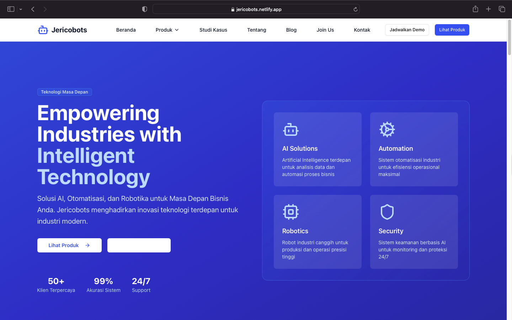
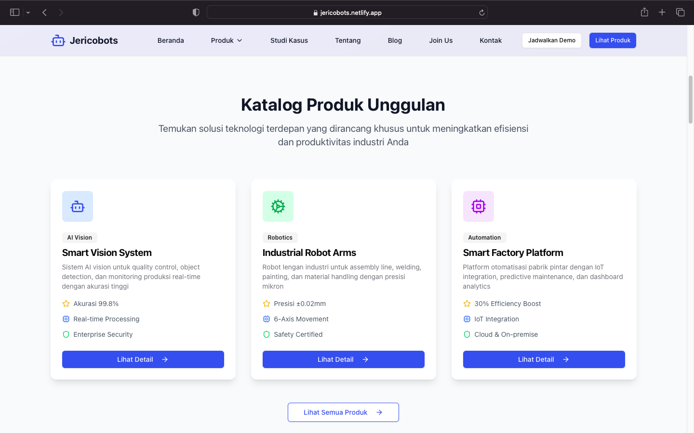
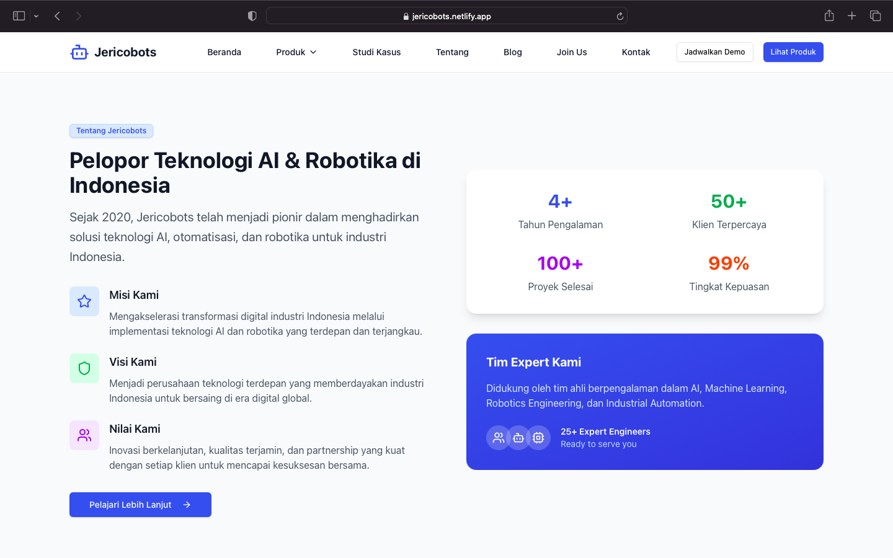
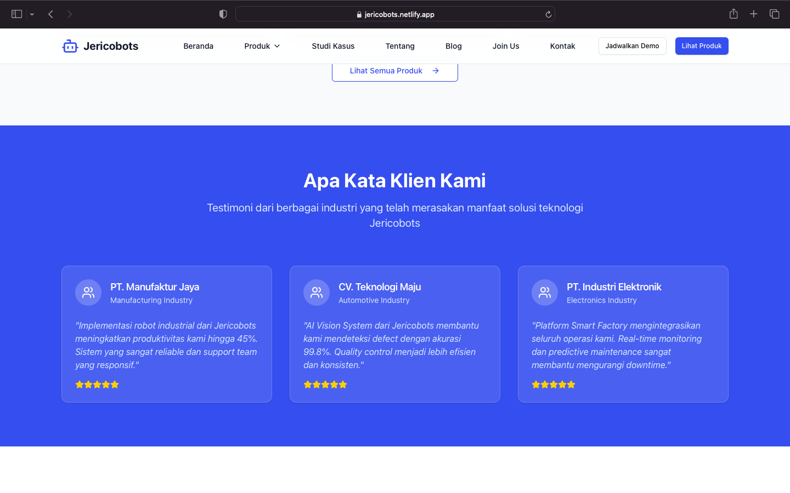
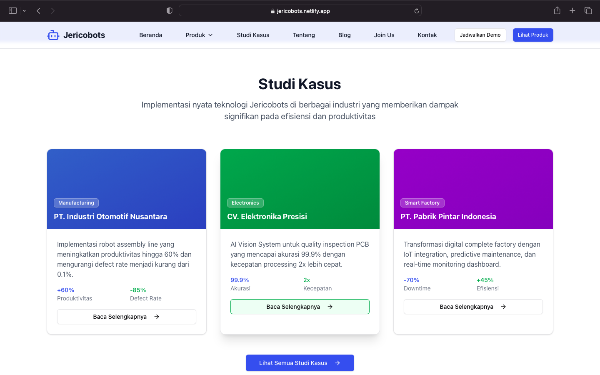
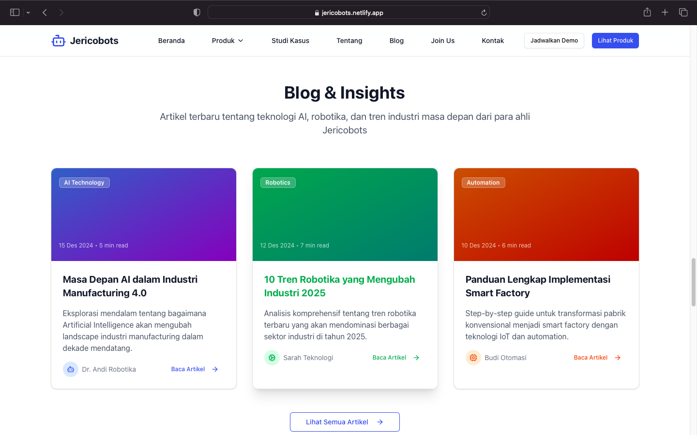

# Jericobots - Website & Catalog 🤖

Selamat datang di repositori Jericobots! Ini adalah proyek situs web yang dibangun dengan Next.js dan Tailwind CSS, berfungsi sebagai katalog produk dan halaman utama untuk perusahaan teknologi fiksi, Jericobots, yang berfokus pada AI dan Robotika.

Dokumentasi ini dirancang untuk membantu pengembang, terutama pemula, memahami cara kerja aplikasi, struktur kodenya, dan cara menjalankannya secara lokal.

## 📋 Daftar Isi

  - [✨ Gambaran Umum Aplikasi](#gambaran-umum-aplikasi)
  - [🛠️ Prasyarat & Instalasi](#prasyarat--instalasi)
  - [🚀 Cara Menggunakan](#cara-menggunakan)
  - [🤔 Pemecahan Masalah Umum](#pemecahan-masalah-umum)
  - [🗺️ Peta Jalan Pengembangan](#peta-jalan-pengembangan)

-----

<a id="gambaran-umum-aplikasi"></a>
## ✨ Gambaran Umum Aplikasi














**Jericobots** adalah situs web interaktif yang menampilkan profil perusahaan teknologi. Tujuannya adalah untuk:

1.  **Menampilkan Produk**: Menampilkan katalog produk unggulan dalam AI, Robotika, dan Otomasi.
2.  **Membangun Citra Merek**: Meningkatkan citra perusahaan sebagai pelopor dalam teknologi industri.
3.  **Menarik Klien & Talenta**: Melalui studi kasus, blog, dan halaman karir.

Aplikasi ini sepenuhnya responsif dan dirancang dengan estetika modern yang cocok untuk industri teknologi B2B. Semua tombol dan tautan navigasi di halaman ini sekarang berfungsi untuk mengarahkan pengguna ke bagian yang relevan di dalam halaman (dengan *smooth scroll*) atau ke tautan eksternal yang sesuai.

-----

<a id="prasyarat--instalasi"></a>
## 🛠️ Prasyarat & Instalasi

Sebelum memulai, pastikan Anda memiliki perangkat lunak berikut yang terinstal di komputer Anda:

  * [Node.js](https://nodejs.org/) (v18.0 atau lebih baru)
  * [Bun](https://bun.sh/) (Digunakan sebagai manajer paket & runtime)
  * [Git](https://git-scm.com/)

### Langkah-Langkah Instalasi

1.  **Kloning Repositori**
    Buka terminal Anda dan jalankan perintah berikut:

    ```bash
    git clone https://jerico-c/jericobots.git
    cd jericobots
    ```

2.  **Instal Dependensi**
    Proyek ini menggunakan `bun` sebagai manajer paketnya. Jalankan perintah:

    ```bash
    bun install
    ```

    Perintah ini akan membaca file `package.json` dan menginstal semua paket yang diperlukan.

-----

<a id="cara-menggunakan"></a>
## 🚀 Cara Menggunakan

Setelah instalasi selesai, Anda dapat menjalankan server pengembangan lokal.

1.  **Jalankan Server Pengembangan**

    ```bash
    bun run dev
    ```

2.  **Buka di Peramban**
    Buka peramban Anda dan navigasikan ke [http://localhost:3000](http://localhost:3000). Anda akan melihat halaman utama Jericobots.

Setiap perubahan yang Anda buat pada kode (misalnya, di `src/app/page.tsx`) akan secara otomatis tercermin di peramban, berkat fitur *Hot Reloading* Next.js. Tombol dan tautan navigasi di halaman utama telah diimplementasikan agar berfungsi, mengarahkan pengguna ke bagian halaman yang relevan atau ke tautan eksternal (misalnya, email atau media sosial) menggunakan `asChild` prop pada komponen `Button` untuk mempertahankan gaya dan semantik yang tepat.

-----
